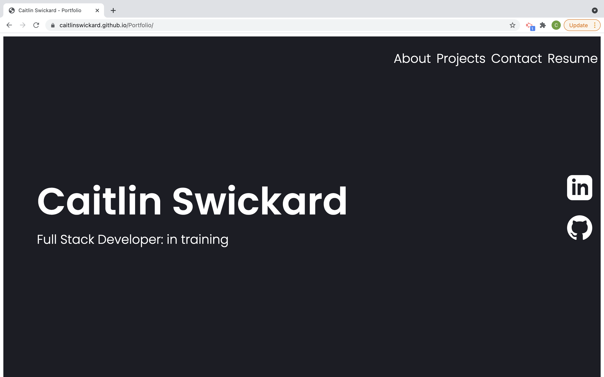
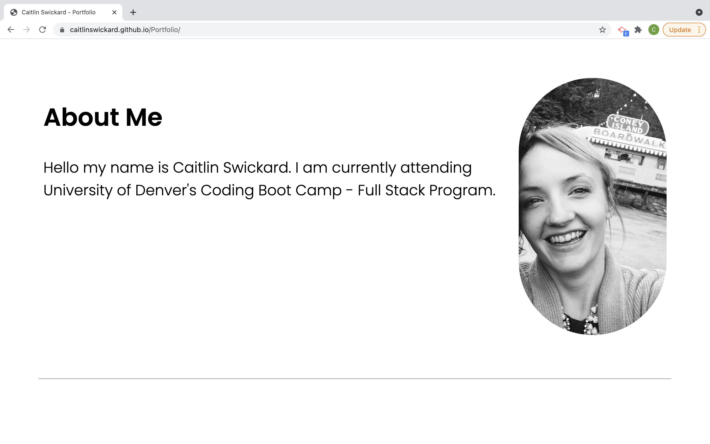
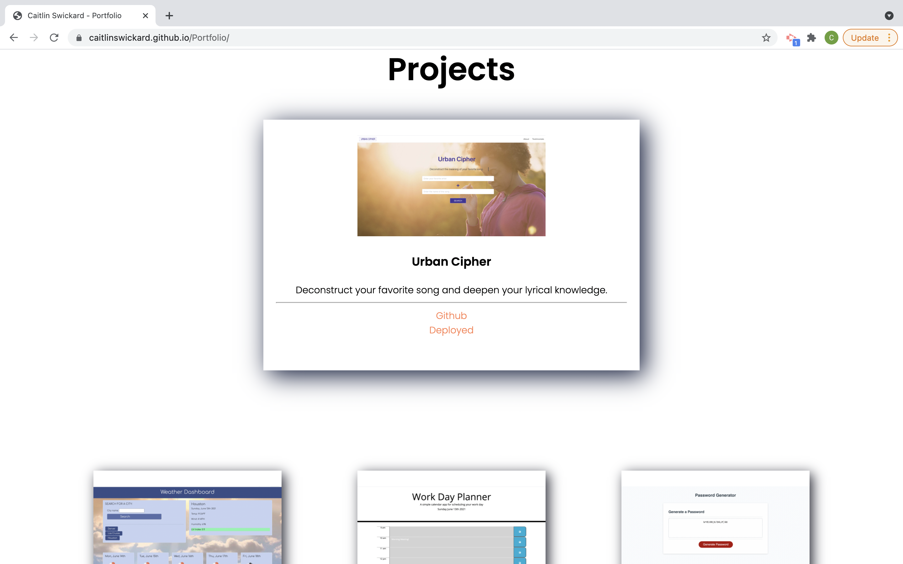
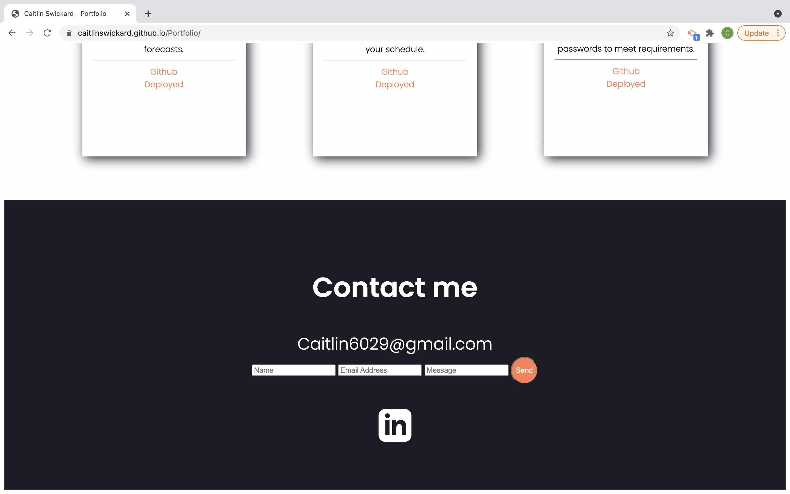

# Personal Portfolio - Caitlin Swickard

This project is a starter Portfolio website for myself. In this portfolio is a section of About me, Projects, Contact and a link to my Resume. There are social media links to my personal Github as well as my Linkedin accounts. Project cards offer a brief intro to project as well as links to Github and Deployed page to view. 

[View site here](https://caitlinswickard.github.io/Portfolio/)

## Built with 
- HTML
- CSS
- JavaScript

## Screen shots of deployed webpage

