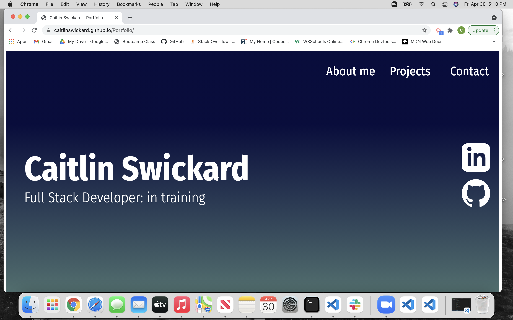
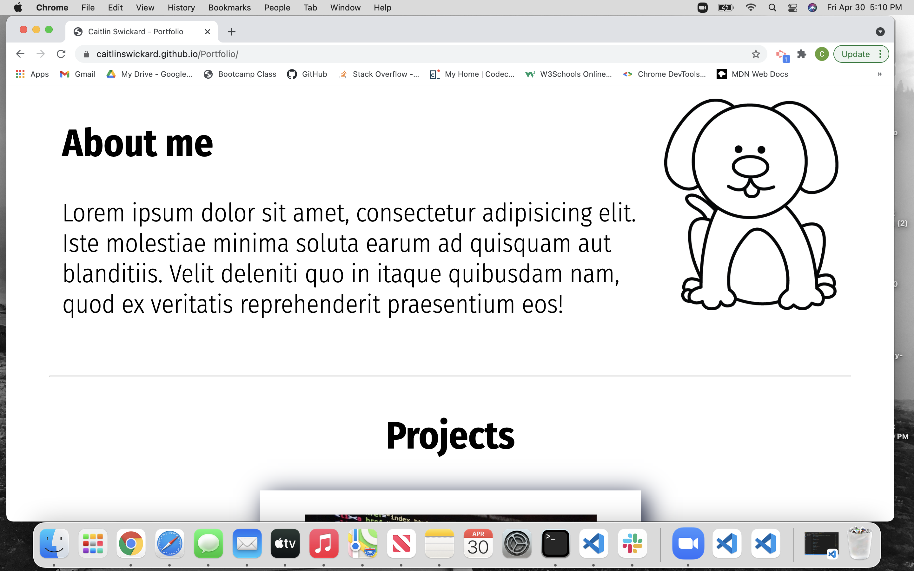
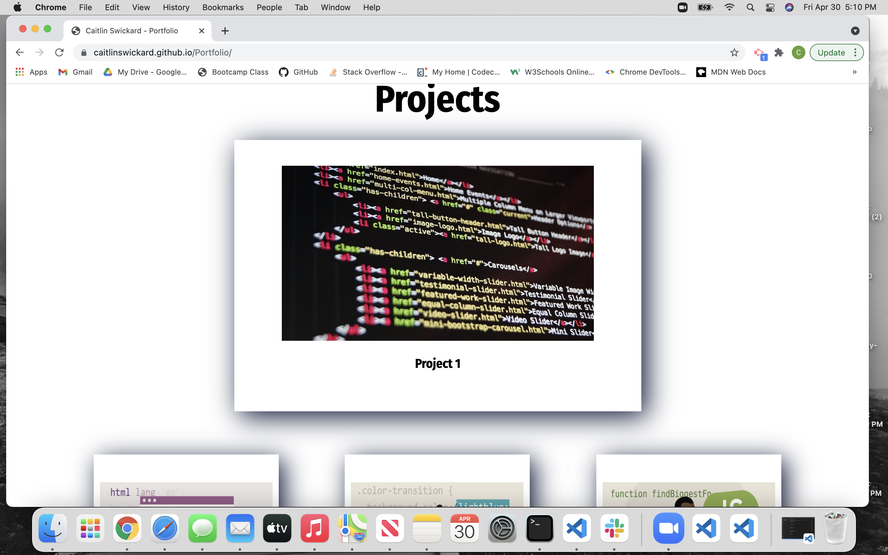
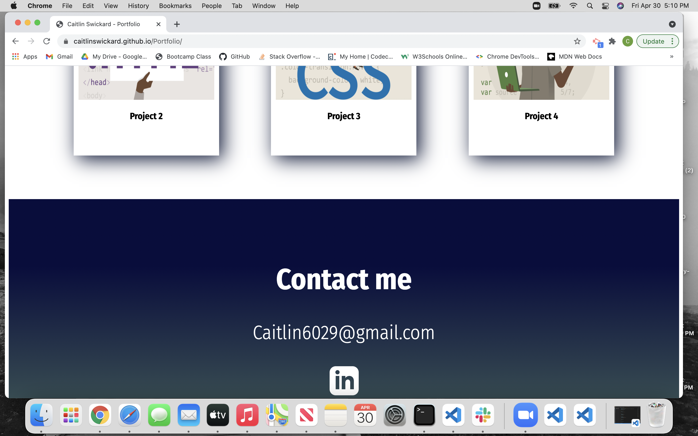

# Personal Portfolio

This project is a starter Portfolio website for myself. In this portfolio is a section of About me, Projects and Contact information. This site is built with flexbox and is responsive to different screen sizes. The social media icons link to my LinkedIn page as well as my GitHub page.

Current place holders in this project:

- about me Lorem text filler
- avatar of dog until I have a head shot
- project cards link to GitHub until I have projects available to link

[View site here](https://caitlinswickard.github.io/Portfolio/)

## Acknowledgments

- Inspiration for skeleton of project:
  Ania Kubow
  March 10,2021
  Build a responsive Portfolio
  Youtube
  https://www.youtube.com/watch?v=-D6oTPA4vXc&t=2692s

## Screen shots of deployed webpage

